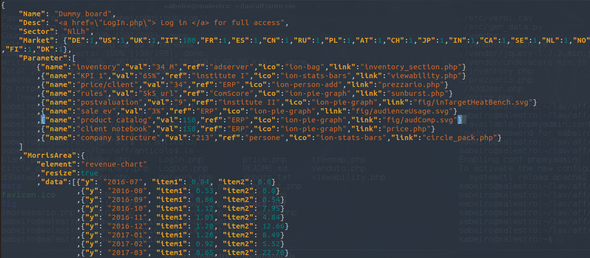
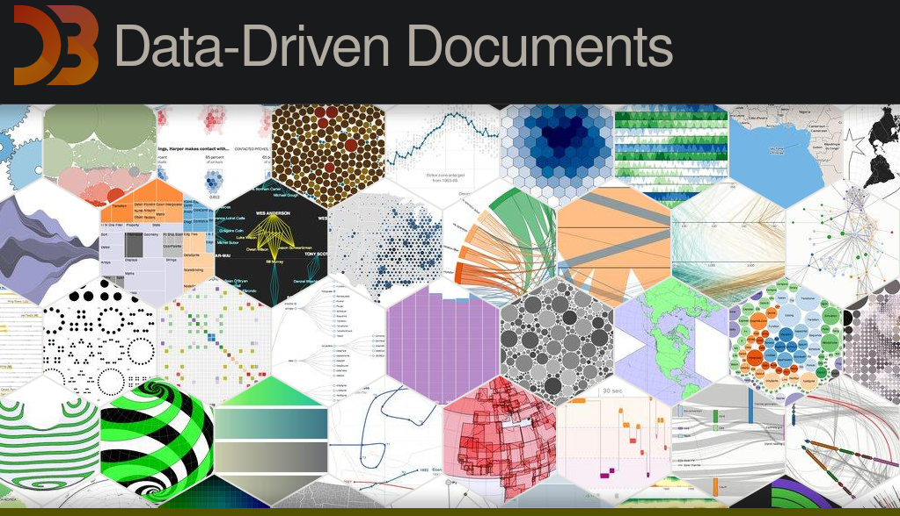

# Anticolo

reporting dashboard made out of a simple automated architecture


# install

```
git clone https://github.com/sabeiro/anticolo.git
cp lib/conf/config.generic.php lib/conf/config.inc.php ## fill in your mysql credentials
unzip plugins.zip
```

# architecture
old style infra


_structured and unstructured data_

unstructured data

_all relevant info_

json rendering

_the info is rendered in the template_

html

_position of the elements_

javascript

_load json and render html at the right place_

php

_sql connector and private area_

sql

_sql tables_

jsonp

_format tables with json callback_

python

_writing sql tables_

R

_R sql access_


# UI

template
<a href="https://adminlte.io/themes/dev/AdminLTE/index.html)  </a>
_template admin lte_

morris<
<a href="http://morrisjs.github.io/morris.js/)  </a>
_format tables with json callback_

cytoscape
<a href="https://js.cytoscape.org/)  </a>
_format tables with json callback_

cubism
<a href="https://square.github.io/cubism/)  </a>
_format tables with json callback_

d3
	<a href="https://d3js.org/)  </a>
_format t_

highcharts
<a href="https://www.highcharts.com)  </a>
_format tables with json callback_

chartist
<a href="http://gionkunz.github.io/chartist-js/)  </a>
_format tables with json callback_

# features

barcharts

_daily/weekly/monthly feeds_

sunburst

_tree exploration_

tree heatmap

_tree exploration_

customer base

_customer difference by cohort_

gain

_testing in different scenarios_

lifetime

_lifetime comparison_

audience composition

_feature split_

gain

_feature split_

line + bar

_effect of events_

forecast

_forecast and past seasonalities_

growth

_relative growth + contributions_

time series

_relative growth + contributions_
